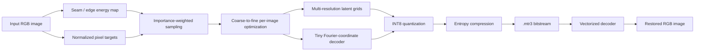
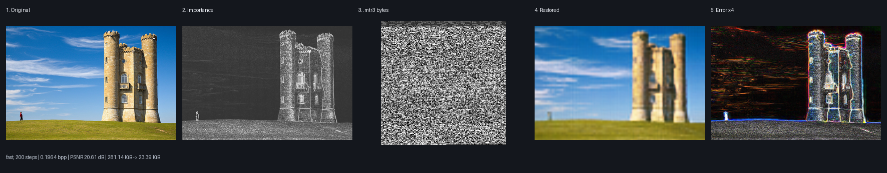
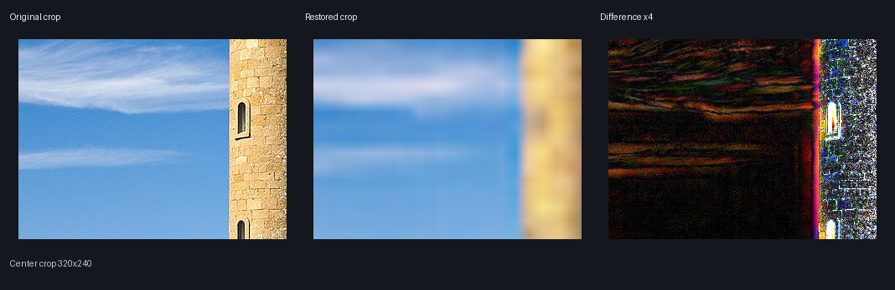

# MTRSA — Memorization Through Retraining with Seam-Aware Rate Allocation

> **Status:** research codec. The original 2022 V2 implementation is preserved as historical material; `v3/` is the current experimental line.

MTRSA started from a simple idea: instead of storing every pixel directly, **train a small neural network on one image and store the learned representation**. V2 additionally used seam energy to select pixels. In 2022 this was a rough experiment; by 2024–2026, per-image overfitted neural compression became a serious research direction through systems such as **C3** and **Cool-Chic**.

V3 turns the old experiment into a measurable codec prototype focused on three things:

1. smaller bitstreams;
2. faster per-image optimization;
3. very cheap decoding without retraining.

## What V2 actually did

The legacy program uses image coordinates as two inputs and RGB as three outputs. A fixed `2 → 10 → 15 → 7 → 3` network is trained on pixels selected by `LowEnergyPixels*`, then its learned layers are saved. See [`NeuralNetworksV2/NeuralNetworksV2/Program.cs`](NeuralNetworksV2/NeuralNetworksV2/Program.cs).

That was already close in spirit to an **implicit neural representation (INR)**, but it had several codec-level limitations:

- no explicit bitstream format;
- no parameter quantization;
- no entropy model / entropy coder;
- no rate–distortion objective;
- one fixed MLP topology for every image;
- low-energy pixels were selected, but important high-frequency structures did not receive explicit bit budget;
- encode time was dominated by naive per-image backpropagation;
- the project depended on old `.NET Framework 4.7.2` binaries (`Energy.dll`, `NeuralNetworkV2.dll`) instead of a reproducible source stack.

## V3 architecture

V3 keeps the original principle — **the representation is optimized for one image** — but changes what is learned and how it is packed.



### 1. Multi-resolution latent grids

A global coordinate MLP wastes capacity trying to memorize both smooth regions and local details. V3 adds compact learnable feature grids at several spatial scales. The decoder samples them bilinearly and combines them with fixed Fourier coordinate features.

This gives the model local memory without storing one feature vector per pixel.

### 2. Seam energy becomes rate allocation, not destructive resizing

The original idea physically centered on low-energy pixels. V3 uses gradient + second-order detail energy as an **importance distribution**:

- smooth/low-energy regions are sampled less aggressively;
- edges, thin structures and texture receive more optimization budget;
- geometry is not altered by default.

This is intentionally safer than physically deleting seams. Real seam removal remains an experimental future mode where seam paths would have to be transmitted and reconstructed explicitly.

### 3. Faster fitting

The encoder uses:

- vectorized PyTorch operations;
- random importance-weighted batches instead of scanning every pixel every iteration;
- a coarse-to-fine latent curriculum;
- AdamW;
- automatic CUDA selection;
- FP16 autocast / gradient scaling on CUDA;
- early stopping after the loss plateaus.

The `fast`, `balanced` and `max` presets trade encode time for representation capacity.

### 4. Quantized self-contained bitstream

Every floating tensor required to decode the image is converted to symmetric **INT8** with one scale per tensor. Quantized payloads are then compressed and stored in a self-contained `.mtr3` container together with:

- image dimensions;
- decoder configuration;
- tensor shapes;
- quantization scales;
- tensor offsets;
- preset / source metadata.

The current alpha uses `zlib` as a conservative dependency-free entropy stage. Replacing it with a learned probability model + rANS is one of the highest-priority compression upgrades.

### 5. Decode without retraining

Decoding only requires:

1. parse `.mtr3`;
2. dequantize compact tensors;
3. evaluate the tiny decoder over the coordinate grid.

There is **no optimization loop at decode time**.

<!-- GUI_APP:START -->
## Desktop GUI

MTRSA now ships as a desktop application as well as a Python codec. The GUI is designed for the actual image -> `.mtr3` -> restored image workflow rather than as a demo wrapper.

**Windows x64:** download the current portable build from [GitHub Releases](https://github.com/Mika-dot/Memorization-through-retraining-with-a-seam-algorithm.-V2./releases/latest). Unzip it and run `MTRSA-GUI.exe`; no Python installation is required.

The application provides:

- drag-and-drop image loading;
- `fast`, `balanced`, and `max` encode presets;
- automatic CPU/CUDA selection when running from source;
- live seam/detail importance visualization;
- image -> self-contained `.mtr3` compression;
- `.mtr3` -> PNG restoration without retraining;
- progress reporting and cancellation;
- source size, encoded size, ratio, bpp, PSNR, encode time, and decode time;
- original / importance / reconstructed previews in one window.

The portable Windows release deliberately bundles the CPU PyTorch runtime for maximum compatibility. A source installation with a CUDA-enabled PyTorch build exposes GPU acceleration through `Device = auto`.

Source: [`v3_gui/`](v3_gui/). Reproducible Windows packaging and release publication: [`.github/workflows/gui-release.yml`](.github/workflows/gui-release.yml).
<!-- GUI_APP:END -->

## Quick start

```bash
cd v3
python -m pip install -e .

mtr3 encode input.png output.mtr3 --preset balanced --device auto
mtr3 decode output.mtr3 restored.png --device auto
```

Presets:

| Preset | Intent | Decoder size | Encoder work |
|---|---|---:|---:|
| `fast` | iteration / previews | small | low |
| `balanced` | default research point | medium | medium |
| `max` | push reconstruction quality | larger | high |

You can override the optimization budget:

```bash
mtr3 encode input.png output.mtr3 --preset balanced --steps 4000 --device cuda
```

## Benchmarking

Do not judge an image codec from one hand-picked picture. V3 includes a benchmark script that records:

- file size;
- bits per pixel (`bpp`);
- PSNR;
- encode time;
- decode time.

```bash
cd v3
python benchmark.py image1.png image2.png --preset balanced --csv benchmark.csv
```

The script also produces JPEG/WebP reference points through Pillow. For serious evaluation, build full rate–distortion curves on **Kodak**, **Tecnick**, **CLIC** and compare against JPEG XL / AVIF / VVC and a JPEG AI implementation under matched quality settings.

No unmeasured "X% better" claim is published in this repository. The code should earn such numbers through reproducible benchmarks.

<!-- BENCHMARK_EXAMPLE:START -->
## Benchmark example: image 1, end to end

This example is generated automatically from the repository's historical **`NeuralNetworksV2/img/1.png`** using the same V3 codec code shipped with the GUI. It is not a cherry-picked claim against another codec; it shows exactly what MTRSA stores and what comes back out.



The stages are:

1. **Original** - input pixels from benchmark image 1.
2. **Importance map** - seam/detail energy used to spend more optimization budget on edges and texture without changing image geometry.
3. **`.mtr3` bitstream** - quantized per-image neural representation. The screenshot is a direct byte-grid visualization of the compressed file, not an image approximation.
4. **Restored image** - decoded by evaluating the compact neural field; no retraining is performed during decode.
5. **Difference x4** - absolute RGB error amplified four times so reconstruction failures are visible.

| Metric | Measured value |
|---|---:|
| Image | 1200 x 813 |
| Preset / optimization | `fast` / 200 steps |
| Source file | 281.14 KiB |
| Raw RGB payload | 2.79 MiB |
| `.mtr3` bitstream | **23.39 KiB** |
| Ratio vs source file | **12.02x** |
| Ratio vs raw RGB | **122.20x** |
| Bits per pixel | **0.1964 bpp** |
| PSNR after quantized round-trip | **20.61 dB** |
| Encode time on CI CPU | 6.343 s |
| Decode time on CI CPU | 0.239 s |

> **Important:** the source image file is already compressed, so `ratio vs source file` is not the same thing as compression relative to raw pixels. For codec research, **bpp + reconstruction quality** is the meaningful pair.

### Zoomed reconstruction check



Individual generated files: [original](docs/benchmark_01/01_original.png) · [importance](docs/benchmark_01/02_importance.png) · [compressed `.mtr3`](docs/benchmark_01/03_compressed.mtr3) · [bitstream visualization](docs/benchmark_01/03_bitstream_visual.png) · [restored](docs/benchmark_01/04_restored.png) · [difference x4](docs/benchmark_01/05_difference_x4.png) · [machine-readable results](docs/benchmark_01/results.json).
<!-- BENCHMARK_EXAMPLE:END -->

## Why the original idea is more relevant now than in 2022

Modern work converged on several ideas that are unusually close to this repository's original direction:

- **C3 (CVPR 2024)** overfits a compact model to each image/video and reports strong rate–distortion performance with low decoding complexity.
- **Cool-Chic** is a low-complexity overfitted neural image/video codec. Version 5.0 (2026) reports substantially faster encoding than its previous generation while improving rate at equal quality.
- **JPEG AI** became the first international end-to-end learned image coding standard in 2025 (`ISO/IEC 6048-1:2025`, `ITU-T T.840.1`).
- **MLICv2 (2025)** demonstrates the continued importance of stronger entropy models and per-instance adaptation.
- **EF-LIC (2026 preprint)** explores eliminating conventional entropy coding to reduce latency — directly relevant to the speed side of this project.
- **Spatial Competition (2026 preprint)** shows that selecting specialized codecs per spatial region can improve compression while keeping a lightweight decoder, which maps naturally to a future seam-aware tile mode here.

The conclusion is not that the 2022 code was already competitive. It is that its central hypothesis — **store an image as an image-specific learned representation** — became a legitimate codec research direction.

## Current V3 implementation

```text
v3/
├── mtr3/
│   ├── bitstream.py   # INT8 packing + .mtr3 container
│   ├── cli.py         # mtr3 encode / decode
│   ├── codec.py       # training, presets, render path
│   ├── model.py       # Fourier features + multiscale latent field
│   └── seam.py        # seam-inspired importance map
├── tests/
│   └── test_smoke.py
├── benchmark.py
├── pyproject.toml
└── README.md
```

The old C# project remains untouched for reproducibility and historical comparison.

## Next performance steps

These are ordered by expected impact rather than novelty.

### A. Better compression ratio

1. **Learned entropy model + rANS** instead of generic zlib. Model each latent level/channel with learned or fitted scale parameters and encode integer symbols with rANS.
2. **Quantization-aware optimization.** Optimize the reconstruction while simulating 8/6/4-bit parameter quantization instead of quantizing only at export.
3. **Mixed precision per tensor.** Flat latent levels can often survive 4–6 bits while final decoder layers may need 8 bits.
4. **Sparse / delta coding.** Zero-centered latent grids should be run-length/sparsity coded; decoder weights can be low-rank or delta-coded against a shared initialization.
5. **True rate–distortion objective**: `L = D(x, x_hat) + λR`, where `R` is the estimated coded length, not only an L1 entropy proxy.
6. **Luma/chroma separation.** YCoCg or YCbCr transforms plus reduced chroma capacity can improve perceptual rate allocation.
7. **Residual coding.** Let the neural field carry low/mid frequencies and encode only sparse high-frequency residuals on difficult tiles.

### B. Faster encoding

1. Cache coordinate/Fourier features.
2. Compile/fuse the tiny decoder (`torch.compile`, Triton or CUDA extension where useful).
3. Optimize latents first and decoder deltas second instead of updating every parameter from step 1.
4. Train only hard tiles after an early global pass.
5. Add a learned initializer / hypernetwork so per-image fitting starts near a good solution.
6. Stop by target bpp/quality instead of a fixed iteration count.

### C. Faster decoding

1. Export a fixed decoder kernel to ONNX / TensorRT / DirectML.
2. Replace GELU with a cheaper activation in low-complexity presets if RD loss is acceptable.
3. Decode tiles independently for cache locality and random access.
4. Add progressive decoding: coarse latent levels first, fine levels on demand.
5. Explore entropy-coding-free latent representations as a separate low-latency mode.

### D. Bring seams back in a modern way

A future **seam-packing mode** can become a distinctive research contribution rather than a preprocessing trick:

1. compute forward-energy seams plus semantic protection masks;
2. remove only seams whose predicted coding cost exceeds the expected geometry penalty;
3. transmit compressed seam paths as side information;
4. reconstruct missing geometry with the neural field;
5. code a residual only where seam reconstruction fails;
6. compare total `R + λD` against the no-seam mode and disable it automatically when it loses.

That makes seam removal a **rate–distortion decision**, not a mandatory transform.

### E. Spatial competition / mode map

For each tile, the encoder can choose the cheapest mode at a target quality:

- neural field only;
- neural + residual;
- transform-only;
- seam-packed neural;
- copy/predict from neighboring latent context.

The selected mode map is tiny side information and gives the encoder freedom to spend complexity only where it pays off.

## Target bitstream direction (`.mtr3`)

The alpha container is deliberately simple. A production research format should evolve toward:

```text
[MTR3 header]
[global decoder / decoder delta]
[mode map]
[coarse latent stream]
[mid latent stream]
[fine latent stream]
[optional residual stream]
[optional seam-path stream]
[index + checksums]
```

This layout enables progressive preview, tile random access, partial decoding and future video extension.

## Research rules for this repository

- Report **bpp + quality + encode time + decode time** together.
- Never compare file sizes at unmatched image quality.
- Keep decoder complexity visible; an encoder can be expensive, a decoder should remain cheap.
- Separate measured results from hypotheses.
- Preserve the original V2 implementation as a historical baseline.

## References / adjacent work

- C3: High-Performance and Low-Complexity Neural Compression from a Single Image or Video, CVPR 2024: <https://openaccess.thecvf.com/content/CVPR2024/html/Kim_C3_High-Performance_and_Low-Complexity_Neural_Compression_from_a_Single_Image_CVPR_2024_paper.html>
- Google DeepMind C3 code: <https://github.com/google-deepmind/c3_neural_compression>
- Cool-Chic: <https://github.com/Orange-OpenSource/Cool-Chic>
- JPEG AI overview: <https://jpeg.org/jpegai/>
- MLICv2 (2025): <https://arxiv.org/abs/2504.19119>
- EF-LIC (2026 preprint): <https://arxiv.org/abs/2605.23323>
- Spatial Competition for Low-Complexity Learned Image Compression (2026 preprint): <https://arxiv.org/abs/2605.13243>

## Legacy material

The original presentation and videos remain in the repository:

- [`Архивация изображения.pdf`](Архивация%20изображения.pdf)
- [`ВИДЕО/`](ВИДЕО/)

V2 is kept as the historical proof of concept; V3 is where new codec experiments should go.
